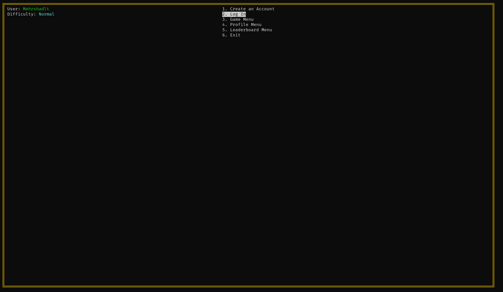
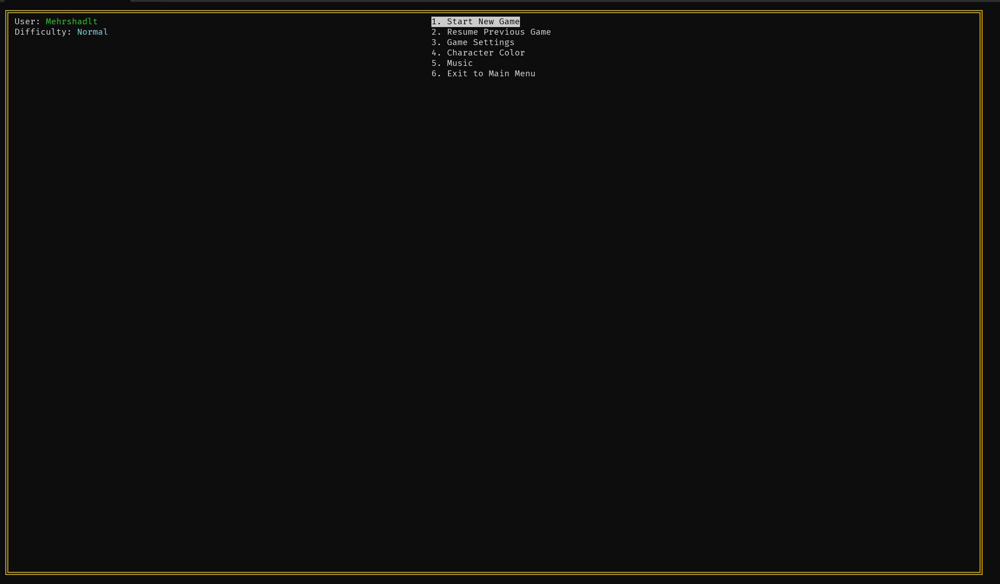
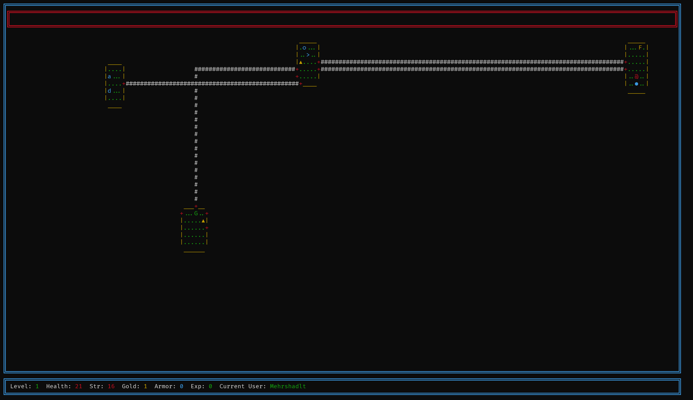
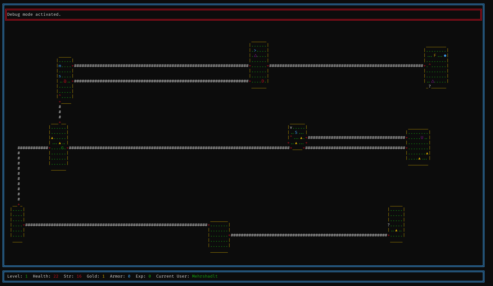
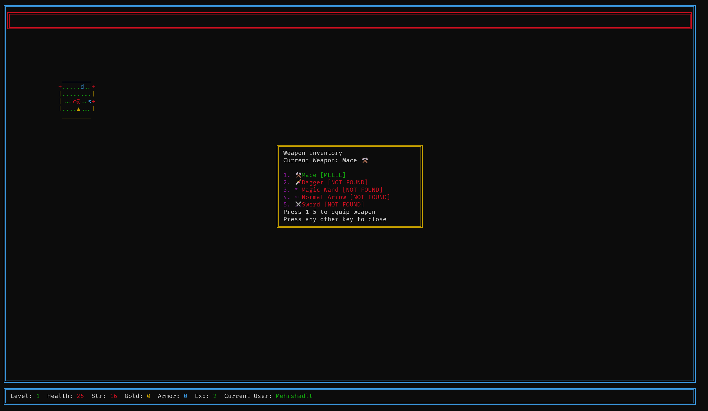
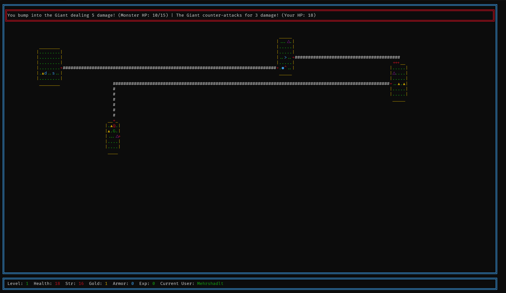
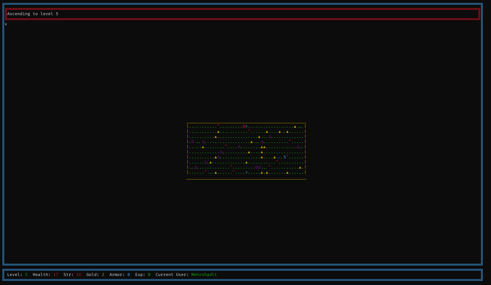
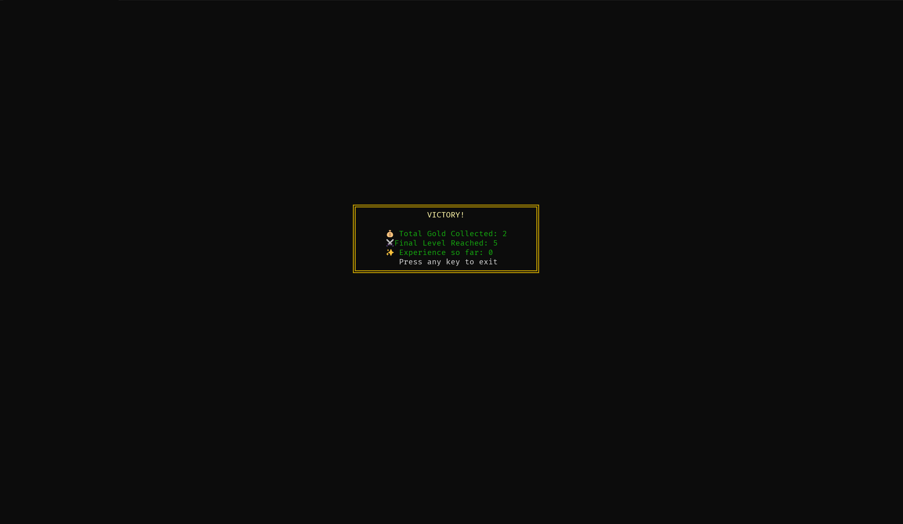

# Rogue — ASCII Dungeon Crawler (Sharif University Final Project)

A terminal-based roguelike inspired by the original Rogue, created as the final project for the Programming course at Sharif University of Technology. The game renders in classic ASCII art using `ncurses` on Linux and persists player data, saves, and leaderboards via SQL.

> Note: Due to its `ncurses` dependency and terminal-focused rendering, setup is primarily targeted at Linux. Windows users can run via WSL. macOS is supported with Homebrew.

---

## Table of Contents

- [Features](#features)
- [Screenshots](#screenshots)
- [Installation](#installation)
- [Build & Run](#build--run)
- [Configuration](#configuration)
- [Gameplay Overview](#gameplay-overview)
- [Saving & Leaderboard](#saving--leaderboard)
- [Controls](#controls)
- [Troubleshooting](#troubleshooting)
- [Academic Context](#academic-context)
- [License](#license)
        
---

## Features

- ASCII art rendering with `ncurses`
- Account system: Register and Login
- Character stats overview and selection
- Pre-game menu to choose character and music
- Procedural room generation:
  - Floors: 5 total
  - Floors 1–4: generated rooms (5–6 up to 9 rooms per floor)
  - Floor 5: Treasure Room (final level)
- Enemies (5 types):
  - Demon
  - Fiery hostile mob
  - Giant
  - Snake (always hostile)
  - Undead (always hostile)
- Weapons (5 types):
  - Mace
  - Sword
  - Arrows (projectile)
  - Wand (projectile/magic)
  - Throwing daggers (projectile)
- Special Rooms:
  - Secret Room can be either a Talisman Room or a Trap Room
  - Talisman effects: Double Damage, Double Saturation Regeneration, Double Speed
- Survival mechanics:
  - Saturation (hunger) system—find, eat, and manage food
- Objectives:
  - Collect as much gold as possible
  - Reach the Treasure Room, clear it, survive traps, and finish with the most gold
- Traps:
  - Normal traps spread throughout floors dealing damage
  - Trap Room packed with hostile snakes
- SQL-backed systems:
  - Saving/loading
  - Leaderboard
  - User and character management

---

## Screenshots


| # | Title               | File Path                                    |
|---|---------------------|----------------------------------------------|
| 1 | Main Menu           | `assets/1_main_menu.png`           |
| 2 | Pre-game Menu       | `assets/2_pregame_menu.png`        |
| 3 | Game HUD            | `assets/3_game_hud.png`            |
| 4 | Game Layout         | `assets/4_game_layout.png`         |
| 5 | Trap Room           | `assets/5_trap_room.png`           |
| 6 | Weapons HUD         | `assets/6_weapons_hud.png`         |
| 7 | Fighting Mechanism  | `assets/7_fighting_mechanism.png`  |
| 8 | Treasure Room       | `assets/8_treasure_room.png`       |
| 9 | Victory Screen      | `assets/9_victory_screen.png`      |


---

## Installation

### Linux (Debian/Ubuntu)

```bash
sudo apt update
sudo apt install build-essential ncurses-dev sqlite3 libsqlite3-dev
```

### macOS (Homebrew)

```bash
brew install ncurses sqlite
# If you use Apple Clang, ensure headers and pkg-config paths for ncurses/sqlite are available.
```

### Windows (WSL)

1. Install WSL and a Debian/Ubuntu distro.
2. Follow the Linux steps inside WSL.

> Note: The project uses SQL for persistence. SQLite is a convenient default, but if you use MySQL/PostgreSQL, adjust build flags and connection settings accordingly.

---

## Build & Run

If a Makefile or build script is present:

```bash
make
./rogue
```

Manual compile example (C with SQLite):

```bash
gcc -O2 -Wall -o rogue src/*.c -lncurses -lsqlite3
./rogue
```

Manual compile example (C++ with SQLite):

```bash
g++ -O2 -Wall -std=c++17 -o rogue src/*.cpp -lncurses -lsqlite3
./rogue
```

> Adjust sources, language (C/C++), and libraries based on your actual code layout. If using MySQL or PostgreSQL, link against their client libraries (e.g., `-lmysqlclient` or `-lpq`) and include proper headers.

---

## Configuration

Create a configuration file (example: `config.ini`) or use environment variables to control database and asset paths.

Example `config.ini`:

```ini
[database]
driver = sqlite     ; options: sqlite, mysql, postgres
path = data/rogue.db

[assets]
music_dir = assets/music

[gameplay]
default_music = dungeon_theme_01
```

- SQLite: ensure `data/rogue.db` directory exists and is writable
- MySQL/PostgreSQL: supply host, user, password, and database name appropriately (via env vars or config)

---

## Gameplay Overview

- Start at the Main Menu, then Register or Login.
- After logging in, choose your character and music in the pre-game menu.
- Floors:
  - Floors 1–4 generate 5–6 up to 9 rooms per floor.
  - Floor 5 is the Treasure Room—the final level.
- Explore rooms, collect gold, fight enemies, avoid traps, manage saturation by finding and consuming food.
- Secret Rooms:
  - Talisman Room: Acquire one of the talismans to gain double damage, double saturation regeneration, or double speed.
  - Trap Room: Filled with hostile snakes—survive to progress.
- Weapons:
  - Melee: mace, sword
  - Ranged/magic: arrows, wand, throwing daggers
- Objective:
  - Finish all 5 floors, clear the Treasure Room, and achieve the highest gold total without dying.

---

## Saving & Leaderboard

All persistence uses SQL:
- Users and authentication
- Characters and stats
- Save slots
- Leaderboard entries

Typical tables (conceptual):
- `users(id, username, password_hash, created_at)`
- `characters(id, user_id, name, stats_blob, created_at)`
- `saves(id, user_id, floor, gold, inventory_blob, created_at, updated_at)`
- `leaderboard(id, user_id, character_name, gold, result, created_at)`

> Schema and exact columns may differ—see the repository’s SQL or migration files if present.

---

## Controls

Common `ncurses` roguelike controls (adjust to your implementation):
- Movement: Arrow keys or `w a s d`
- Interact/Pick up: `Enter` or Enter
- Weapons Inventory: `i`
- Food Inventory: `e`
- Talisman Inventory: `T`
- Attack: Just bump the enemy with the weapon or use arrow keys to shoot projectile
- Cheat codes : `m` for debug (shows the whole map).
- Cheat codes : `f` to fast travel in a direction.
- Cheat codes : `v` to add all weapons.
- Cheat codes : `R` to reload the map.
- Save/Exit/Load: `k` / `q` / `l`

> Replace with the precise keymap from your code.

---

## Troubleshooting

- Black screen or garbled output:
  - Ensure your terminal supports required encoding; try `LANG=C` or `LANG=en_US.UTF-8`.
  - Confirm `TERM` is set (e.g., `xterm-256color`).
- Build errors for `ncurses`:
  - Verify `ncurses-dev` (Linux) or Homebrew `ncurses` (macOS) is installed.
  - Include headers `<ncurses.h>` or `<curses.h>` consistently.
- Database not found or write errors:
  - Ensure the database path exists and is writable.
  - For SQLite, the file is created automatically if the directory is writable.
  - For MySQL/PostgreSQL, verify credentials and network reachability.
- No sound/music:
  - Confirm assets are placed under `assets/music` and referenced correctly.
  - Terminal roguelikes often have limited audio; check documentation for playback support.

---

## Academic Context

This project was developed as the final assignment for the Programming course at Sharif University of Technology. It demonstrates:
- Terminal UI programming with `ncurses`
- Procedural content generation
- State management with SQL-backed persistence
- Classic roguelike mechanics adapted to an academic setting

---

## License

All rights preserved.

---

## Acknowledgments

- Inspired by the original Rogue and classic ASCII roguelikes
- `ncurses` community and documentation
- Open-source SQL libraries (e.g., SQLite)
- And Thank you for reading it all the way to here :)
---

## Contributing

Issues and pull requests are welcome. Please include:
- Platform and environment details
- Precise reproduction steps
- Logs or screenshots where applicable

